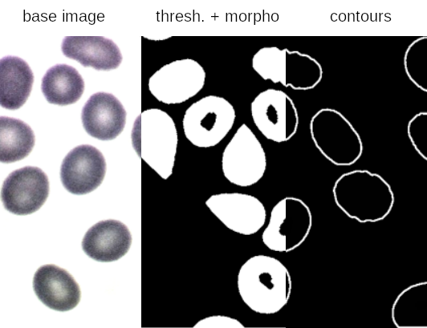
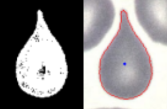
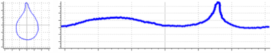

# Classification de cellules basée sur les contours

Projet Master 1 - 2015-2016\
Université de Caen Normandie\
Auteur : Évariste Daller

Projet réalisé en C++ avec Qt et OpenCV.

## Description

Logiciel d'extraction d'informations pour la cytologie, et principalement de descripteurs graphiques (basés contours) permettant la classification de cellules.

Les informations pouvant être extraites sont de deux natures :

* Population de cellules (comptage)
* Descripteurs de formes

## Population de cellules

Un outil de comptage des cellules est proposé, basé sur un seuillage
(seuil manuel ou [méthode d'Otsu](https://fr.wikipedia.org/wiki/M%C3%A9thode_d%27Otsu)),
suivit d'un comtage des contours externes observés.

Ci-dessous les étapes clés de la détection :

## Descripteurs de forme

Deux descripteurs de forme basés contours sont implémentés.
Les contours sont extraits à l'aide d'un outil de pointage et d'une croissance de région.

### Signature polaire

Le premier descripteur est la signature polaire de la cellule sélectionnée.

### Descripteurs de Fourier

Il s'agit de conserver les n premiers coefficients de Fourier obtenus par une FFT
sur la variation de l'orientation de la tengente au contour.

Pour un cercle, cette variation une constante dépendant du rayon du cercle. Le
descripteur quantifie la variation par rapport au cercle.

Plus d'informations dans les slides (doc/slides-soutenance.pdf) et le rapport (doc/Rapport_DALLER.pdf).

## Crédits

Le logiciel utilise deux widgets externes à Qt :

*  __QtOpenCVViewerGl__ (Licence GNU Lesser GPL 3) : [Github](https://github.com/Myzhar/QtOpenCVViewerGl)
* __QcustomPlot__ (Licence GNU GPL 3) : [Gitlab](https://gitlab.com/DerManu/QCustomPlot) | [site web](https://www.qcustomplot.com/)

